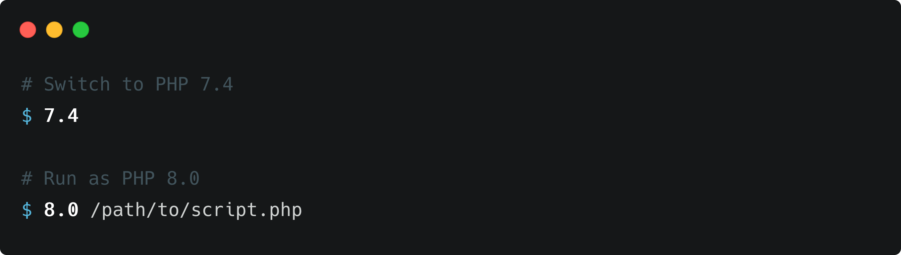

---

**php-switch** is a small utility script that helps you easily run PHP scripts
with a specific version or to completely switch the default PHP version on your
system. I use it personally in combination with
[`shivammathur/php`](https://github.com/shivammathur/homebrew-php).

## Installation

**php-switch** is distributed as a Homebrew
[formula](https://github.com/nhedger/homebrew-php-switch), which you can install
by running the following command.

```shell
brew install nhedger/php-switch/php-switch
```

Finally, initialize it by adding the following line anywhere in your `~/.zshrc`
file.

```shell
source php-switch
```

## Usage

Duing initialization, **php-switch** will look for installed PHP versions in
your Homebrew Cellar. Any installed PHP version will be made available to you in
your shell as functions named after the PHP version.

### Switching to a different version

To switch to a PHP version, simply type its version number (omitting the patch
number). For example, to switch to PHP 8.1 run the following.

```shell
8.0
```

Once the PHP version has been switched, its version will be printed out.

### Running under different version

You may not always want to switch your default PHP version but still need to
quickly run a script under a specific PHP version. To do that, prefix your PHP
script with the version you want to run it with. For example, to run `test.php`
under PHP 7.4, run the following.

```shell
7.4 test.php
```

## License

This utility script is open-sourced software distributed under the
[MIT License](LICENSE).
